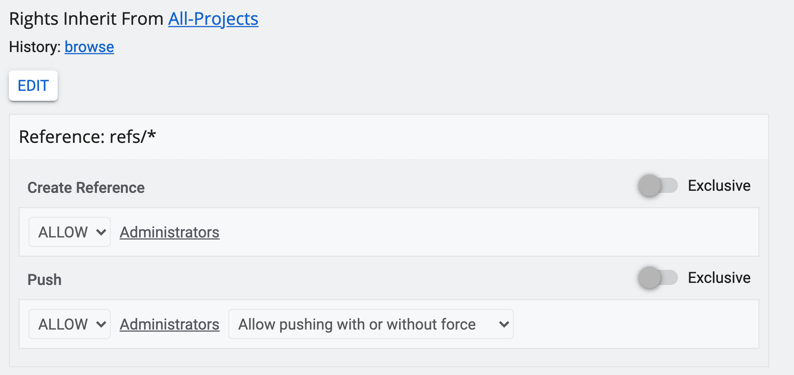

Gatling's SBT Gerrit Test
=========================

A simple project showing how to configure and use Gatling's SBT plugin to run Gatling simulations
against Gerrit Code Review.

This project uses SBT 1, which is available [here](https://www.scala-sbt.org/download.html).

Pre-requisites
--------------

Run Gerrit v3.2.x or newer with a project available for load-testing purposes and
create a user with a well-known password and associated SSH key.
The project needs to have create-reference permissions enabled
in the ACLs for the load-test user. Additionally, if the user is different
from the local git user (you will see "invalid committer" errors
in the `target/simulation.log`) you will need the forge-committer-identity permission.

The test is destructive, do not use any existing production projects for load-testing
purposes.

The test rely on a HTTP/Cookie authenticaton for the GUI-based testing and on
user/password and SSH PublicKey authentication for the GIT-based testing.

Configuration
-------------

The simulations use the following environment variable to run the tests:

Variable | Description | Sample
---------|-------------|---------
 GERRIT_HTTP_URL | Gerrit GUI URL | http://host.docker.internal:8080
 GERRIT_SSH_URL | Gerrit SSH URL | ssh://admin@host.docker.internal:29418
 GERRIT_PROJECT | Gerrit project for load test | load-test
 ACCOUNT_COOKIE | HTTP Cookie to access the Gerrit GUI | aSceprr3WikzGrfwg2PvpOhMMcH5qp3ehW
 XSRF_TOKEN | XSRF_TOKEN Cookie to access the Gerrit GUI for pOST operations | 7d02b54405863778dfe1
 GIT_HTTP_USERNAME | Username for Git/HTTP testing | admin
 GIT_HTTP_PASSWORD | Password for Git/HTTP testing | secret
 GIT_TIMEOUT | Timeout in seconds for Git operations testing | 30
 NUM_USERS | Number of concurrent user sessions | 10
 DURATION | Total duration of the test | 2m
 RUN_ANONYMOUS_USER | Run REST api simulation for anonymous user | true
 REVIEWER_ACCOUNT | Account of the user executing the review | 1000000
 STDDEV_SEED | Standard deviation random generator seed | Random seed
 NUMBER_OF_TAGS_TO_DELETE_AT_ONCE | How many tags to "bulk" delete with one request | 3

Additionally, every test accepts an optional "${scenarioName}_PAUSE" and a
"${scenarioName}_STDDEV_PAUSE" environment variable, that can either be set or not.

For example: `AbandonThenRestoreChange_PAUSE`

This will set `pause` value for each step of that scenario, helping it become more realistic.
The scenario name is the simple name of the class implementing that scenario.
Setting the pause per test also helps if the server under test struggles with the
load of http requests.

Get the project
---------------

```bash
$ git clone https://github.com/gerritforge/gatling-sbt-gerrit-test.git && cd gatling-sbt-gerrit-test
```

Expose simulation.env variables
-------------------

```base
while IFS= read -r line; do export $line; done < simulation.env
```
Run all simulations
-------------------

```bash
$ sbt gatling:test
```

Run a single simulation
-----------------------

```bash
$ sbt "Gatling / testOnly gerritforge.GitSimulation"
$ sbt "Gatling / testOnly gerritforge.GerritRestSimulation"
```

List all tasks
--------------------

```bash
$ sbt "tasks -v gatling"
```

Run tests in Docker
-------------------

The top-level Makefile allows to package all tests into a Docker image and push
to a Docker registry. The scenario is useful for running Gatling tests on a cloud
setup (e.g. AWS or similar) and scale them up to multiple workers.

For building the tests into a Docker image:

```bash
$ make build
```

For running the tests from Docker, with the environment variables defined in
`simulation.env`:

```bash
$ make run
```

For making a parallel execution of multiple runs with concurrent Docker:

```bash
$ make JOBS=2 parallel-run
```

Run a single simulation with the concurrent Docker image:

```bash
$ make run-single TARGET_SIMULATION=GerritRestSimulation
```

*NOTES*:
* When running multiple jobs in parallel, the make command would
end immediately, and the simulations will continue to run in the background.
Each parallel simulation job logs a `background-job-<n>.log` under the `target/gatling/` directory.
* A public key to associate with the user running the Gatling tests is present in the repository (`id_rsa.pub`).
Before running the tests, make sure to add it to the users' SSH keys.
* The authenticated user will also need `Code-Review +2 ` permissions on the selected project.
* The project will need a master branch.
* The only submit requirement for the selected project *needs* to be `Code-Review +2`.
* REVIEWER_ACCOUNT can be any form of identifier for a user, including account id or email.
    It cannot be yourself or a non-existing user.
* The repo the tests will run against (`GERRIT_PROJECT`) will need the following ACLs to be set:


Using Local Repositories
------------------------------

If we want to test against a large, already existing, repository, cloning it for each user might
become expensive and time consuming. Cloning from a local repository can help alleviate that burden.

Simply add `LOCAL_REPO_PATH=file:<path-to-local-repo>` to `simulation.config` and the repository
will be cloned using the local repository path.

*NOTE*: Local Repository is only used in the `CreateChangeCommand`, as it doesn't make sense to
performance test clone against a local repo.
*IMPORTANT*: If running using docker, remember to mount the repository onto the container by
amending the Makefile.
